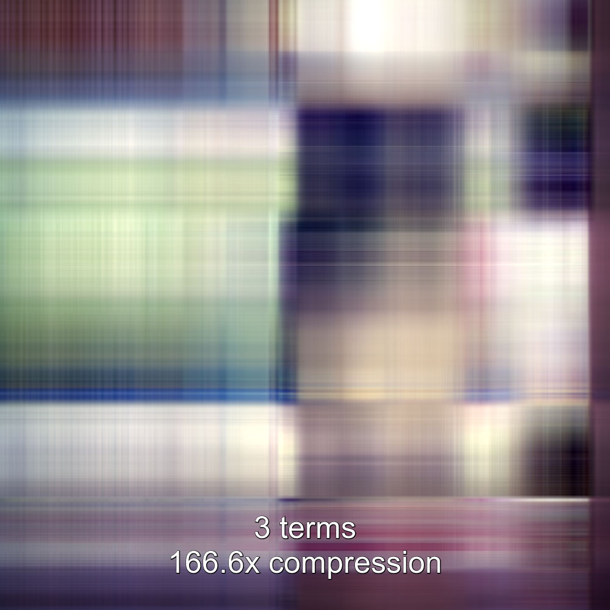

# An image compression program written in C

This is a C program I wrote for fun to apply linear algebra theory I learned in Monash uni. The code uses singular value expansion method to reduce the size of an image. Here is are compression examples, featuring my cat Marmite.

<a href="https://youtu.be/7JXdEilZ2cE" target=”_blank”></a>


## Setup

### 1. Install GCC

In order to compile the program, you will need the GCC, a C compiler. Check if it's installed with the command that prints its version.

```
gcc -v
```

If you get an error, install GCC on your system.

### 2. Install OpenBLAS library

Follow [these instructions](doc/install_open_blas.md) to install OpenBLAS library.


### 3. Download the source code

Next, download the source code of the compressor (requires [git](https://git-scm.com)):

```
git clone https://github.com/evgenyneu/image_compressor_c.git
cd image_compressor_c
```

### 4. Build the program

Finally, build the program:

```
make
```

This will create the executable file `/build/compressor`.


## Usage

Compress an image file [marmite.jpg](marmite.jpg) using ten terms of the singular value expansion and five iterations of the power method:

```
./build/compressor --terms=10 --iterations=5 marmite.jpg compressed.jpg
```

It creates an image named `compressed.jpg` that looks like this:


You can experiment with the `--terms` and `--iterations` options and see how it affects the image quality and compression ratio.


### Available options

```
compressor [--help] [--terms=10] [--iterations=5] IMAGE OUTPUT

IMAGE :  path to the image to compress
OUTPUT :  path to the compressed image that will be created
--terms :  number of terms in the singular value expansion
--iterations :  number of iterations of the power method
--notext :  no annotation on the image
--benchmark :  run the benchmark to measure compression performance,
               no other options are needed for the benchmark
--help :  show this message
```


## Run unit tests 

```
make test
```

## The unlicense

This work is in [public domain](LICENSE).


## Compression results

### Original uncompressed image


### Compressed images

The program produced the following compressed images:





